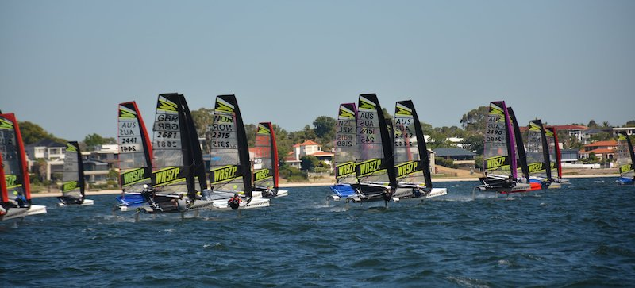

# garda waszp games day 01

Morgen dann nur noch solche Wenden...

<iframe width="560" height="315" src="https://www.youtube.com/embed/DiPCpilkNtE" frameborder="0" 
allow="accelerometer; autoplay; encrypted-media; gyroscope; picture-in-picture" allowfullscreen></iframe>

# garda waszp games day 01

Zwei mal das Ziel verpasst, den dritten Lauf aufgegeben... morgen dann Angriff!

<iframe width="560" height="315" src="https://www.youtube.com/embed/G_1LP3Z6pW4" frameborder="0" 
allow="accelerometer; autoplay; encrypted-media; gyroscope; picture-in-picture" allowfullscreen></iframe>

# garda waszp games Schlalom

Wieder gabs zum Start (und zum Spass) einen Schlalom vor den Meisterschaften. Leider hatte es nicht allzuviel 
Wind und es war schwierig auf den Foils zu bleiben. Den ersten Lauf habe ich knapp überstanden. Bei der zweiten 
Runde war aber schon Schluss.

Konnte dann aber noch paar Vorwind sowie Amwind Kurse segeln und bin bereit für morgen Mittwoch.

# road to garda waszp games (europeans 2019)


Nach den Musto Worlds in Medemblik, Holland (5 Tage a 3 Läufe (60 min)) bin ich eingesegelt und unterwegs nach 
Malcesine am Gardasee. Die Musto Worlds waren super, bei den windigen Tagen konnte ich gut mit den ersten 20 
mithalten. Bei weniger Wind, aber immer noch Trapezwind gab es leider zu viele Fehler. Am Schluss bin ich 22. von rund 90 aktiven Booten.

<iframe width="800" height="600" src="https://www.youtube.com/embed/nkj2Mdi4OX4" frameborder="0" 
allow="accelerometer; autoplay; encrypted-media; gyroscope; picture-in-picture" allowfullscreen></iframe>

Morgen geht es am Gardasee los mit dem Schlalom. Muss jedoch schauen, ob ich es zeitlich hinkriege, weil ich am 
Boot noch ein neues Trampolin einziehen muss. Bin aber optimistisch und motiviert am Nachmittag mitzusegeln.

[weblink zum livestream Schlalom](http://www.waszp.com/news/slalom-live)

# perth waszp games (worlds 2019)


[results waszp games](http://www.sportspage.com.au/yacht_clubs/rfbyc/WASZPgames/WASZP_2019_Games_Overall.htm)<br>
[official facebook page](https://www.facebook.com/waszpgames)<br>
[weather forecast](https://www.seabreeze.com.au/weather/wind-forecast/perth)

## 28 January (Race Day 5)
Der letzte Lauf gesegelt. Hat alles geklappt, vom Start bis zum Ziel schön gesegelt. Knapp 12-14 kn Wind aber grosse Wellen von den Motorbooten (Australier hatten am Montag frei wegen Australia Day). Habe noch einen Platz verloren im Gesamtklassement aber sehr zufrieden. Das Mietboot ist zusammengeräumt und nach einem schönen Nachtessen im Club ist das Abenteuer Waszp Games in Perth fertig. Danke allen fürs folgen und bis zum nächsten Mal:
- Garda 2019?
- Miami 2020?
- Aukland 2021?


## 27 January (Race Day 4)
### update
Wegen den guten Windverhältnissen wurde noch ein zusätzlicher Lauf angehängt. Habe die ersten zwei Starts komplett verschlafen und bin noch zusätzlich paar Mal gekentert. Im dritten Lauf dann super Start und unter den ersten 10 um die Boje. Dann aber bei jeder Halse gekentert und jedes Mal 10 Boote verloren. Am Gesamtklassement hat sich nichts geändert. Versuche heute noch einen guten Lauf zu segeln.


Noch vier Läufe sind in den nächsten zwei Tagen zu segeln. Der Doktor (Seebreaze) sollte nicht mehr so stark sein wie in den letzen Tagen. Die Australier warten aber jeweils immer so lange, bis der Wind schön über 15 kn liegt. Alles unter 3 Beaufort gilt hier nicht als Segeln.


## 25 January (Race Day 3)
Heute würde eigentlich die Vereinsversammlung vom Segel Club oberer Walensee anstehen. Ich muss mich leider abmelden, weil ich hier in Perth am segeln bin. Heute waren es zwei super Läufe bei schönen 20 kn Wind. Beide Läufe gut gestartet und keine Fehler gemacht. Mit den Resultaten 22, 21 bin ich nun wieder auf der ersten Seite vom Gesamtklassement. Morgen ist kein Segeln (Australia Day) und auf unserem Regattarevier viel zu viel Verkehr ist.


## 24 January (Race Day 2)
Wieder drei Läufe gesegelt. Die Rägne 26, 21 und 32 sind Mittelfeld. Da kann ich mit meinem Boatspeed nichts besser machen. Der Wind hier in Perth ist stark und bei weitem nicht so launisch wie bei uns in Europa. Es kommt also hauptsächlich auf den Start, Amwindspeed an. Da muss ich wohl noch ein paar hundert Stunden auf dem Wasser investieren um diese Art von Boot auf den gleichen Speed zu bringen wie die Top Leute. Werde morgen noch versuchen gut zu starten und keine Fehler bei den Manövern zu machen. Es stehen noch 6 Läufe an.


## 23 January (layday)
Heute keine Regatten. Nicht ganz sicher ob es wegen zu viel Wind oder zu kalten Tempteraturen ist? Die Australier sind bereits mit Pullover und Jacke unterwegs. Für mich kommt der Ruhetag nach 8 Segeltagen gerade richtig, Finger, Muskeln und Gelenke ruhen lassen. Donnerstag/Freitag die nächsten paar Regatten. Wind sowie Temperaturen werden sich bis dahin wieder auf Normalwerte stabilisieren.


## 22 January (Race Day 1)
### update
Drei Läufe gesegelt. Hatte kaum Fehler gemacht, ausser bei den letzen zwei Läufen jeweils Amwind auf der falschen Seite zu sein. Trotzdem sehr zufrieden mit dem Segeln. Morgen ist Sturm (19Grad kalt) und kein Segeln.<br>
[results](http://www.sportspage.com.au/yacht_clubs/rfbyc/WASZPgames/WASZP_2019_Games_Overall.htm)


### morning
Heute gilt es ernst mit den ersten paar Läufen für die Games. Hier noch ein paar Photos vom Clubhäuschen (die Toiletten sind grösser als das ganze Clubhaus vom Segel Club oberer Walensee)<br>


## 21 January (Schlalom)
Habe sämtliche Qualiläufe überstanden und bin schlussendlich in's Finale geflogen. Bin bei den drei Finalläufen gut gestartet und immer unter den ersten Drei um die erste Marke geflogen, dann jedoch falsche Taktik und schlechte Manöver gemacht. Trotzdem super Tag und gutes Gefühl für die Meisterschaften die morgen starten. <br>
Zwecks Überzahl im "Garnd Final" haben die mich kurz vor dem Final auch spontan Eingebürgert. G'day mate und bis morgen...
<br>

<br>
- M.Coutts (Sohn von Russel, der Papa fährt ihm den ganzen tag hinterher... )
- T.Johnson (Oracle Team USA, VOR Dongfeng)
- P.Leboucher (Profisegler Figaro/470er)

## 2o January (Banane)
3 Stunden auf dem Wasser für gerade mal eine Banane. Und dann bin ich diese nicht mal zu Ende gesegelt. Als Erklärung, eine Banane ist beim Segeln einmal rauf, einmal runter. Ein Regattakurs ist normalerweise zwei Bananen. Die Regattaorganisotoren können aber einen normalen Kurs abkützen (meistens weil der Wind nicht mehr stimmt) und dann wird man schon nach einer Banane gewertet. <br>
Die australischen Meisterschaften sind nun zu Ende. Habe viel gelernt und viel am Boot rumgetestet. Jetzt liegt es an mir, gut zu Starten und Amwind auf Kurs zu bleiben.

## 19 January

### update night
Doch nicht ganz "relaxing day". Es gab wieder drei Läufte bei 15-20kn. Starts habe ich alle drei verpasst und bin nicht gut weggekommen. Amwind ab un zu sehr gut unterwegs, aber Probleme mit Fähre und anderen kleinen Details gehabt. Am Schluss noch ganz um das Vorwindgate geflogen statt durch und nicht gewertet worden. Morgen dann wieder "serious day" am letzen Tag der Nationals.<br>
[results](http://www.sportspage.com.au/yacht_clubs/rfbyc/WASZPnationals/WASZP_2019_Australian_Championship_Overall.htm)<br>
### update morning
Relaxing day, 40° Celsius, less windy than yesterday, late start in the afternoon
<iframe width="100%" height="150" scrolling="no" frameborder="no" allow="autoplay"
src="https://w.soundcloud.com/player/?url=https%3A//api.soundcloud.com/tracks/193839719&color=%23ff0000&auto_play=false&hide_related=false&show_comments=true&show_user=true&show_reposts=false&show_teaser=true"></iframe>

## 18 January (Details)
Beim Segeln muss jeweils alles passen um nicht ganz hinten zu landen. So habe ich die Unterschrift auf der Auslaufliste vergessen, dann nicht mitgekriegt dass die Australier 3 min Starts (statt 5 min) haben und zu guter letzt zwei mal Amwind gekentert. Der zweite und dritte Lauf dann viel bessert. Starts waren ok (Siehe Bild unten ganz rechts). Am Schluss waren es Rang 19,17. Wenn ich einstellige Ränge segeln will muss ich Amwind mehr höhe fahren, das geht nur mit viel Luvkrängung, aber heikel bei böigem Wind. Morgen geht's erst um 16:00 auf's Wasser, da am Samstag die Australier ihre Boote ausfahren und es erst spät genügend Platz für uns hat.<br>
[results](http://www.sportspage.com.au/yacht_clubs/rfbyc/WASZPnationals/WASZP_2019_Australian_Championship_Overall.htm)<br>


<br><br>


## 17 January
"patchy wind" heisst es auf English. Auf dem Bild vom kleinen Berg, der in Windrichtung von unserem Regattarevier steht, schön zu sehen. Auf dem Photo hat es unten Zürichseewind von 2-4 kn aus allen Richtungen, in der Mitte Walenseewind von 10-15kn und am anderen Ufer dann australische 20-25kn. In der Mitte noch eine kleine Untiefe und viele Motorboote sowie Kursschiffe. Dazu ab morgen noch ca. 60 andere Waszps.
<br>Ziel für die nächsten zwei Tage der australischen Meisterschaften heisst, mal allen Problemen aus dem Weg gehen und vor dem dritten Tag auf der Jasstafel nachschauen, ob ich die Strategie anpassen muss.


## 16 January (Scheinbarer Wind)

[scheinbarer wind](https://de.wikipedia.org/wiki/Wahrer_und_scheinbarer_Wind#Scheinbarer_Wind)<br>
[beaufortskala](https://de.wikipedia.org/wiki/Beaufortskala)<br>
[knoten]( https://engineering.mit.edu/engage/ask-an-engineer/why-is-speed-at-sea-measured-in-knots/)

Heute waren es wieder rund 90 Minuten auf dem Wasser. Bei rund 20cm Welle macht das mit den Foilern richtig Spass. Vorwind hatte ich kaum Problem, auch durch die Halse kein Problem auf den Foils zu bleiben. Anders sieht der Amwindkurs aus. Wir hatten so 15kn plus alle 2-3 Minuten Böen bis 25kn für 30 Sekunden.

Gute 5 Beafourt.

Ich habe mich auf dem Heimweg gefragt, wieso hier ohne Welle der Vorwind einfacher ist als der Amwind. Habe das kurz durchgerechnet und wenn man die Resultate kurz studiert, wird auch klar, wieso Vorwind ohne Welle (voll) easy ist.

[norweger am fliegen](https://www.facebook.com/waszpgames/videos/388457785059272/)

Wahrer Wind + Fahrtwind = Scheinbarer Wind

Bewegt man sich auf dem Wasser (gleiches gilt auch an Land), ergibt sich aus dem Fahrtwind und dem wahren Wind der scheinbare Wind.

In Zahlen heisst das mit meinem fliegendem Boot:
- Amwind (+45° zum Wind) 15 kn wahrem Wind + 11 kn Fahrtwind = scheinbarer Wind von 24 kn (in der Böe 33 kn)
  - Amwind also 5-6 Beafourt
- Vorwind (-45° zum Wind) bei 15 kn wahrem Wind + 21 kn Fahrtwind = scheinbarer Wind von 15 kn (in der Böe 18 kn)
  - Downwind also 4-5 Beafourt

Als Fazit heisst das für mich Amwind alles dicht ziehen bis zum Anschlag und Vorwind auf keinen Fall abbremsen.

```python
import numpy as np
```


```python
def calcApparent(wind, boat):
    return np.linalg.norm(wind+boat)
```


```python
def calcSpeed(vector):
    return int(np.linalg.norm(vector))
```


```python
wind = np.array([0,15]); print('wind:', calcSpeed(wind),'kn')
gust = np.array([0,10]); print('gust:', calcSpeed(gust),'kn')
upwind = np.array([8,8]); print('upwind speed:', calcSpeed(upwind),'kn')
downwind = np.array([15,-15]); print('downwind speed:', calcSpeed(downwind),'kn')
```

    wind: 15 kn
    gust: 10 kn
    upwind speed: 11 kn
    downwind speed: 21 kn


```python
print('apparent up:  ', int(calcApparent(wind, upwind)),'kn', \
      'with gust:', int(calcApparent(wind+gust, upwind)),'kn')
print('apparent down:', int(calcApparent(wind, downwind)),'kn', \
      'with gust:', int(calcApparent(wind+gust, downwind)),'kn')
```

    apparent up:   24 kn with gust: 33 kn
    apparent down: 15 kn with gust: 18 kn

## 15 January
boat is ready, already flown perfectly<br>
<br>
PPC (perfect perth condition)<br>


## 14 January (Perth)
hello sunshine<br>


## 12 January (Mühlehorn)
sailing stuff plus sharkknife packed, ready for Perth...<br>


<iframe id="contactMap" src="https://maps.google.com.au/maps?f=q&amp;source=s_q&amp;hl=en&amp;geocode=&amp;q=Hobbs Place, Peppermint Grove WA 6011&amp;ie=UTF8&amp;t=m&amp;z=14&amp;output=embed"></iframe>

## Training
* 15 January 2019 Boatwork
* 16 January 2019 Practice Day 1
* 17 January 2019 Practice Day 2

## National Championship	 	
* 18 January 2019 Race Day 1
* 19 January 2019 Race Day 2
* 20 January 2019	Race Day 3

## International Waszp Games	 	
* 22 January 2019 Race Day 1
* 23 January 2019 Race Day 2
* 24 January 2019 Race Day 3
* 25 January 2019 Race Day 4
* 26 January 2019 Australia Day (no racing)
* 27 January 2019 Race Day 5
* 28 January 2019 Race Day 6

# garda waszp games (euro 2018)


