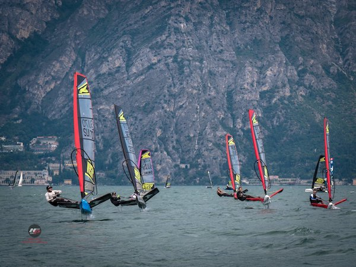

# perth waszp games (worlds 2019)

## 12 January (Mühlehorn)
sailing stuff packed, ready for Perth...

[official facebook page](https://www.facebook.com/waszpgames)

[entry list](https://www.revolutionise.com.au/rfbyc/eventlist/20319)

[weather forecast](https://www.seabreeze.com.au/weather/wind-forecast/perth)

<iframe id="contactMap" src="https://maps.google.com.au/maps?f=q&amp;source=s_q&amp;hl=en&amp;geocode=&amp;q=Hobbs Place, Peppermint Grove WA 6011&amp;ie=UTF8&amp;t=m&amp;z=14&amp;output=embed"></iframe>
           
## National Championship	 	
* 18 January 2019 Race Day 1
* 19 January 2019 Race Day 2
* 20 January 2019	Race Day 3

## International Waszp Games	 	
* 22 January 2019 Race Day 1
* 23 January 2019 Race Day 2
* 24 January 2019 Race Day 3
* 25 January 2019 Race Day 4
* 26 January 2019 Australia Day (no racing)
* 27 January 2019 Race Day 5
* 28 January 2019 Race Day 6

# foiling videos
<iframe width="560" height="315" src="https://www.youtube.com/embed/E0gb0Lb2gzM" frameborder="0" allow="accelerometer; autoplay; encrypted-media; gyroscope; picture-in-picture" allowfullscreen></iframe>

<iframe width="560" height="315" src="https://www.youtube.com/embed/gVDLwug-XlI" frameborder="0" allow="accelerometer; autoplay; encrypted-media; gyroscope; picture-in-picture" allowfullscreen></iframe>

<iframe width="560" height="315" src="https://www.youtube.com/embed/fahqIxdpReE" frameborder="0" allow="accelerometer; autoplay; encrypted-media; gyroscope; picture-in-picture" allowfullscreen></iframe>

# garda waszp games (euro 2018)

